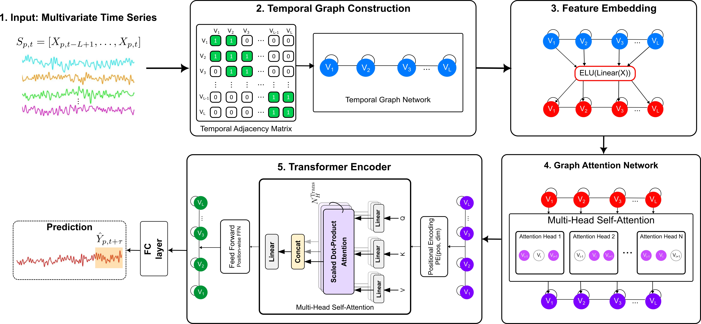

# Graph Attention-Transformer for multivariate time series forecasting: application to drought

## Summary

The aim of this project is to propose a **Graph Attention-Transformer (GAT-Transformer)** architecture for multivariate time series forecasting, specifically applied to drought monitoring in West Africa.

- [X] **Hybrid Architecture:** Synergistically combines Graph Attention Networks (GAT) to model dynamic short-range dependencies and Transformer Encoders to capture long-range global patterns.
- [X] **Regional Application:** Validated on the forecasting of the Standardized Precipitation Index (SPI) in West Africa using satellite-derived environmental data (NDVI, LST, Soil Moisture).
- [X] **Generalization:** Demonstrates strong capability to generalize to unseen geographical regions without retraining.
- [X] **Open Science:** Provides open-source scripts for satellite data acquisition via Google Earth Engine, preprocessing, and deep learning model implementation.

## Required software and library

The main software used was **Python 3.10+**.
The complete list of required packages is listed in the `requirements.txt` file. Key dependencies include:

* **Deep Learning:** `torch` (PyTorch)
* **Geospatial:** `earthengine-api`, `geemap`, `rasterio`, `geopandas`, `shapely`
* **Data Processing:** `numpy`, `pandas`, `scikit-learn`, `scipy`
* **Visualization:** `matplotlib`, `tqdm`

## Workflow

The repository is organized into two primary components to separate the data pipeline from the modeling phase:

- [X] **(A) `data download and preprocessing`**: Contains scripts for downloading raw satellite imagery from Google Earth Engine, masking geospatial data, and generating aligned multivariate time series arrays.
- [X] **(B) `model`**: Contains the PyTorch implementation of the GAT-Transformer, training loops, benchmark comparisons, and inference scripts for generalization analysis.

### A. Data Download, Preprocessing & Time Series Creation

Navigate to the `data download and preprocessing/` folder to run these steps.

1.  **`download_spi_chirps.ipynb`**: Calculates and downloads the Standardized Precipitation Index (SPI) using CHIRPS Daily precipitation data.
2.  **`download_ndvi.ipynb`**: Downloads monthly Normalized Difference Vegetation Index (NDVI) data from MODIS Terra (MOD13A3).
3.  **`download_lst.ipynb`**: Downloads Land Surface Temperature (LST) data from MODIS Terra (MOD11A1).
4.  **`download_soil_moisture.ipynb`**: Downloads monthly Soil Moisture data from NASA GLDAS.
5.  **`mask_soil_moisture.ipynb`**: Applies country-specific shapefile masks to clean and clip the downloaded raster data.
6.  **`time_series_creation.ipynb`**: The integration step. It aligns all spatial rasters temporally, handles missing values, and stacks them into final `.npz` files (multivariate time series arrays) ready for training.

### B. Model Training and Prediction

Navigate to the `model/` folder to run these steps.

1.  **`GAT-Transformer.ipynb`**: The core training script. It includes:
    * Offline data imputation logic.
    * Definition of the `SpiPredictorGATTransformer` architecture.
    * Training loop with early stopping.
2.  **`forecasting-benchmarks.ipynb`**: Comparative experiments running baseline models (LSTM, GRU, Dense, pure Transformer) on benchmark datasets (DC Weather, Ukraine NDVI, Household Power).
3.  **`Generalization and pixel level analysis.ipynb`**: Inference script. It loads the pre-trained model weights and performs predictions on unseen test regions to generate the spatial analysis maps and scatter plots found in the paper.

### Data Sources

The project utilizes ~24 years of satellite observation data (2000–2023) covering West Africa.

- [X] **Target Variable:** Standardized Precipitation Index (SPI-1) derived from [CHIRPS Daily](https://developers.google.com/earth-engine/datasets/catalog/UCSB-CHG_CHIRPS_DAILY).
- [X] **Input Feature:** Normalized Difference Vegetation Index (NDVI) from [MODIS Terra](https://developers.google.com/earth-engine/datasets/catalog/MODIS_006_MOD13A3).
- [X] **Input Feature:** Land Surface Temperature (LST) from [MODIS Terra](https://developers.google.com/earth-engine/datasets/catalog/MODIS_006_MOD11A1).
- [X] **Input Feature:** Soil Moisture from [NASA GLDAS](https://developers.google.com/earth-engine/datasets/catalog/NASA_GLDAS_V021_NOAH_G025_T3H).

### Outputs and Results

**Case Study: West Africa**
The model was trained and validated on data from **Guinea-Bissau**, achieving state-of-the-art performance on the test set with an $R^2$ of **0.9492**, significantly outperforming baselines like LSTM ($0.9330$) and pure GAT ($0.8363$).

**Generalization**
The model demonstrated robust generalization capabilities when applied to neighboring countries without any retraining. It successfully predicted drought conditions in:
* **Senegal**
* **Gambia**
* **Guinea**

**Pixel-Level Analysis**
The repository includes scripts to visualize pixel-level forecasts vs. actuals, demonstrating the model's ability to track seasonal drought cycles effectively across the different study regions.

## How to cite?
This manuscript has been submitted to **Computers & Geosciences**. If you use this code or data, please cite it as follows once published:

> Ayed, A., Balti, H., & Ben Abbes, A. (Under Review). Graph Attention-Transformer for multivariate time series forecasting: application to drought. *Computers & Geosciences*.
