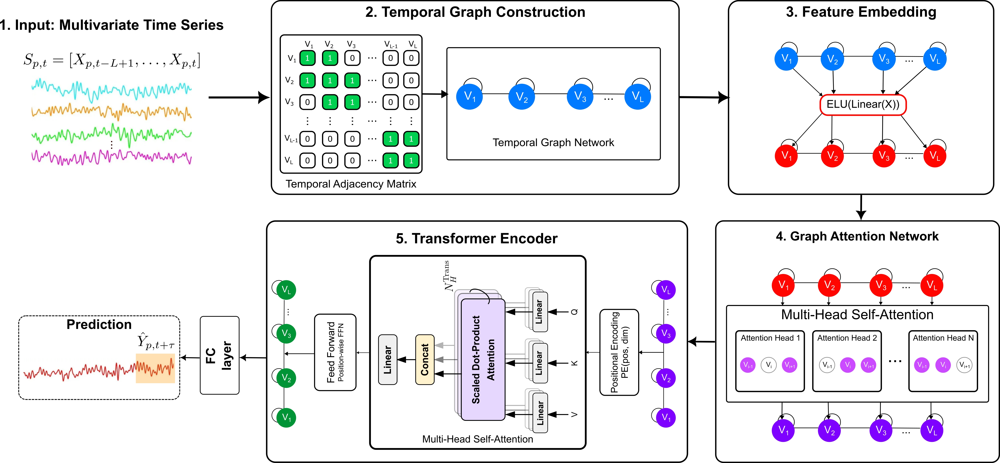

# Graph Attention-Transformer for multivariate time series forecasting: application to drought

## Summary
The aim of this project is to propose a **Graph Attention-Transformer (GAT-Transformer)** architecture for multivariate time series forecasting, specifically applied to drought monitoring in West Africa.

* **Hybrid Architecture:** Synergistically combines Graph Attention Networks (GAT) to model dynamic short-range dependencies and Transformer Encoders to capture long-range global patterns.
* **Regional Application:** Validated on the forecasting of the Standardized Precipitation Index (SPI) in West Africa using satellite-derived environmental data (NDVI, LST, Soil Moisture).
* **Generalization:** Demonstrates strong capability to generalize to unseen geographical regions without retraining.
* **Open Science:** Provides open-source scripts for satellite data acquisition via Google Earth Engine, preprocessing, and deep learning model implementation.

## License
This project is licensed under the **GNU General Public License v2.0**.

## Required software and library
The main software used was **Python 3.10+**.
The complete list of required packages is listed in the `requirements.txt` file. Key dependencies include:

* **Deep Learning:** `torch` (PyTorch)
* **Geospatial:** `earthengine-api`, `geemap`, `rasterio`, `geopandas`, `shapely`
* **Data Processing:** `numpy`, `pandas`, `scikit-learn`, `scipy`
* **Visualization:** `matplotlib`, `tqdm`

## Installation from github
To access the source code and run the models locally, please follow these steps:

### 1. Download
Download the repository from the [Github repository](https://github.com/Ghoul-tn/GAT-Transformer): green button "clone or download" or use the command:
`git clone https://github.com/Ghoul-tn/GAT-Transformer.git`

### 2. Go in the directory
Once this has been done, open a terminal or command prompt and navigate to your directory location:
`cd GAT-Transformer`

### 3. Launch the local installation
Install the required dependencies listed in the requirements file:
`pip install -r requirements.txt`

### 4. Testing
To verify the installation, you can run the core training script using the provided sample data:
`cd model`
`python GAT-Transformer.ipynb` (or open via Jupyter Notebook)

## Computational Requirements
* **Hardware:** While inference can be performed on a CPU, training the hybrid GAT-Transformer architecture is optimized for a GPU.
* **Recommended Environment:** This model was developed and tested using an **NVIDIA GPU P100**.

## Workflow
The repository is organized into three primary components to separate the data pipeline, sample data, and the modeling phase:

### A. Data Download, Preprocessing & Time Series Creation
*Note: This step is required to generate datasets for other countries (e.g., Senegal, Guinea, or Guinea-Bissau) as their processed files exceed GitHub's 25MB limit.*

1.  **`download_spi_chirps.ipynb`**: Calculates and downloads the SPI using CHIRPS Daily precipitation data.
2.  **`download_ndvi.ipynb`**: Downloads monthly NDVI data from MODIS Terra.
3.  **`download_lst.ipynb`**: Downloads LST data from MODIS Terra.
4.  **`download_soil_moisture.ipynb`**: Downloads monthly Soil Moisture data from NASA GLDAS.
5.  **`mask_soil_moisture.ipynb`**: Applies country-specific shapefile masks to clean and clip the data.
6.  **`time_series_creation.ipynb`**: Aligns spatial rasters, handles missing values, and stacks them into final `.npz` files.

### B. Ready-to-use Data
The `/data` folder provides a sample multivariate time series array to test the model architecture immediately:
* **`Gambia_data.npz`**: Pre-imputed time series data for The Gambia.

### C. Model Training and Prediction
Navigate to the `model/` folder to run these steps:
1.  **`GAT-Transformer.ipynb`**: The core training script using the `SpiPredictorGATTransformer` architecture.
2.  **`forecasting-benchmarks.ipynb`**: Comparative experiments running baseline models (LSTM, GRU, Dense, pure Transformer).
3.  **`Generalization and pixel level analysis.ipynb`**: Inference script for performing predictions on unseen test regions.

## Data Sources
The project utilizes ~24 years of satellite observation data (2000–2023) covering West Africa.
* **Target Variable:** SPI-1 derived from [CHIRPS Daily](https://developers.google.com/earth-engine/datasets/catalog/UCSB-CHG_CHIRPS_DAILY).
* **Input Features:** NDVI and LST from [MODIS Terra](https://developers.google.com/earth-engine/datasets/catalog/MODIS_006_MOD13A3).
* **Input Features:** Soil Moisture from [NASA GLDAS](https://developers.google.com/earth-engine/datasets/catalog/NASA_GLDAS_V021_NOAH_G025_T3H).

## Outputs and Results
The model was trained and validated on data from **Guinea-Bissau**, achieving an $R^2$ of **0.9492**, significantly outperforming baselines like LSTM ($0.9330$) and pure GAT ($0.8363$). It demonstrates robust generalization capabilities when applied to **Senegal**, **Gambia**, and **Guinea** without retraining.

## How to cite?
This manuscript has been submitted to **Computers & Geosciences**. If you use this code or data, please cite it as follows:

> Ayed, A., Balti, H., & Ben Abbes, A. (Under Review). Graph Attention-Transformer for multivariate time series forecasting: application to drought. *Computers & Geosciences*.
